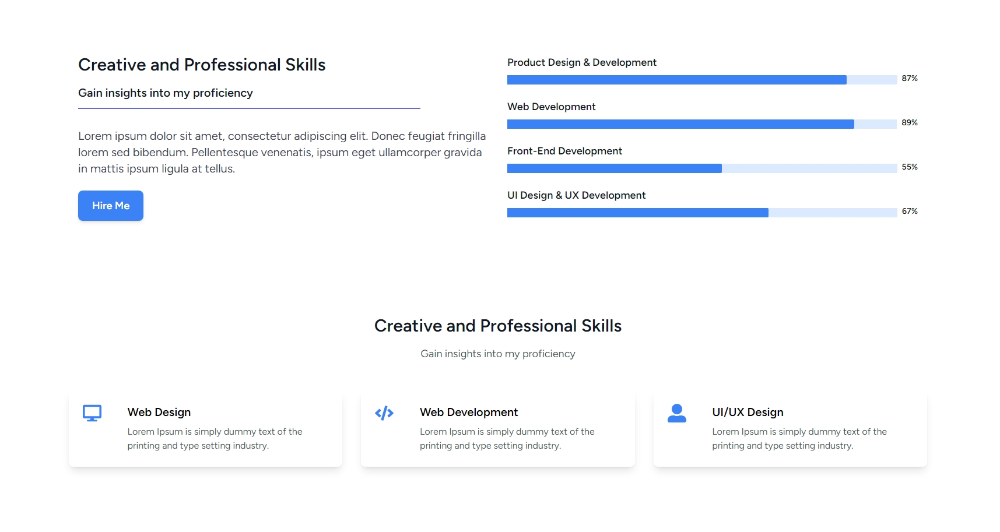

# Belal Elshorbagy Portfolio

This is a portfolio website for a Graphic designer & Motion Graphic. It is built using Laravel and React and Inertia.js and provides a simple and easy-to-use interface for showcasing the designer's work. 

## Features

- Projects
  - Display portfolio projects with images, descriptions, and links to view more details.
  - Full CRUD API To ADD projects
  - Responsive Animation Design

